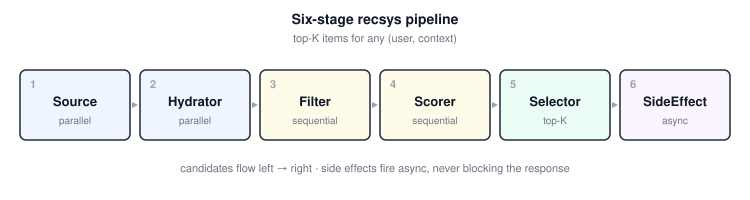

# recsys-pipeline-architect

> A Claude skill for designing composable recommendation, ranking, and feed pipelines — built around the six-stage **Source → Hydrator → Filter → Scorer → Selector → SideEffect** framework popularized by xAI's open-sourced [For You algorithm](https://github.com/xai-org/x-algorithm).

[](LICENSE)
[](#installing-the-skill)
[](#examples)
[](https://github.com/xai-org/x-algorithm)
[](https://skills.sh/mturac/recsys-pipeline-architect)

<p align="center">
  
</p>

## Why this exists

Most "recommendation systems" in production aren't exotic ML — they're **pipelines**. You fetch candidates from one or more sources, enrich them with metadata, drop the ineligible, score the rest, sort, pick the top K, then fire off async side effects. The scoring model and the items change. The pipeline shape doesn't.

xAI open-sourced this exact shape in 2024 with their For You algorithm ([Apache 2.0](https://github.com/xai-org/x-algorithm)). This skill turns it into a reusable recipe and applies it well beyond social feeds — Strapi content CMSs, RAG rerankers, task prioritizers, notification triage, search reranking, ad selection: anywhere you need *"the top K items for this (user, context)."*

When you invoke the skill, Claude walks you through eight steps (use case → sources → hydrations → filters → scorers → selector → side effects → scaffold), surfaces the architectural trade-offs you'd otherwise default through silently (multi-action vs single-score, candidate isolation vs joint scoring, online vs offline), and emits a runnable scaffold in your stack.

## What's in the box

- **`SKILL.md`** — the skill itself. Drop into `~/.claude/skills/recsys-pipeline-architect/` for Claude Code, or paste into a Claude.ai project's custom instructions.
- **`references/`** — load-on-demand deep dives: interface definitions in 4 languages, the multi-action scoring pattern, candidate isolation, a filter cookbook (12 patterns), a scorer cookbook (weighted sum, MMR, diversity penalty, position debiasing).
- **`examples/`** — three runnable scaffolds in different stacks, every one green on its test suite.

## The six-stage pattern

| # | Stage | Job | Parallel? |
|---|---|---|---|
| 1 | Source | Fetch candidates from one or more origins | Yes |
| 2 | Hydrator | Enrich candidates with metadata | Yes |
| 3 | Filter | Drop ineligible candidates | No (sequential) |
| 4 | Scorer | Assign scores | No (chain order matters) |
| 5 | Selector | Sort and pick top K | Single op |
| 6 | SideEffect | Cache, log, emit events, update served-history | Async (non-blocking) |

The skill walks you through each stage, surfaces the trade-offs (multi-action vs single-score, candidate isolation vs joint scoring, online vs offline batch), and generates a runnable scaffold in your stack.

## Examples

### Strapi v5 content feed — TypeScript

`examples/strapi-content-feed/` — a Strapi plugin that adds `GET /api/feed/for-you` to any Strapi instance with an `article` content type. Multi-action scoring with `P(read)`, `P(like)`, `P(share)`, `P(skip)`. Author diversity. Standard filters. Jest tests cover stage ordering, parallel source fan-out, and source-error tolerance.

### Zentra-compatible pipeline — Go

`examples/zentra-go/` — Go implementation packaged as a Zentra `engine.Module`. The `pipeline/` package is standalone and usable outside Zentra. Uses generics for type-safe candidate flows; tests exercise filtering, sorting, parallel sources, and error survival.

### PMAI task prioritizer — Python / FastAPI

`examples/pmai-task-prioritizer/` — applies the pattern to task ranking. `GET /tasks/next?user_id=42&limit=10` returns the top tasks for a user based on priority, due date, in-progress status, and project diversity. Verified runnable: includes a pytest suite and a working FastAPI endpoint.

## Installing the skill

### Claude Code

One-liner via [skills.sh](https://skills.sh/mturac/recsys-pipeline-architect):

```bash
npx skills add mturac/recsys-pipeline-architect
```

Or clone directly into your Claude skills folder:

```bash
mkdir -p ~/.claude/skills/
git clone https://github.com/mturac/recsys-pipeline-architect.git \
  ~/.claude/skills/recsys-pipeline-architect
```

Then in a Claude Code session:

```
/skill recsys-pipeline-architect
```

Or just describe a recsys/ranking/feed problem and Claude Code will load the skill via its trigger keywords.

### Claude.ai (chat)

1. Open a Claude project.
2. Paste the contents of `SKILL.md` into the project's custom instructions.
3. Upload the `references/` files as project knowledge so they load on demand.

## Trying the examples

### Strapi

```bash
cd examples/strapi-content-feed
npm install
npm test
```

Integrating into a real Strapi v5 project: see `examples/strapi-content-feed/README.md`.

### Go

```bash
cd examples/zentra-go
go test ./pipeline/
go run examples/ranking_demo.go
```

### Python

```bash
cd examples/pmai-task-prioritizer
pip install -e .
pip install pytest pytest-asyncio
pytest tests/
uvicorn api:app --reload
curl 'http://localhost:8000/tasks/next?user_id=42&limit=5'
```

## Attribution

The six-stage pipeline pattern (Source → Hydrator → Filter → Scorer → Selector → SideEffect), the multi-action scoring approach, and the candidate isolation rule are inspired by xAI's open-sourced X For You algorithm:

https://github.com/xai-org/x-algorithm (Apache 2.0)

This repository is an independent reimplementation of the *pattern* in TypeScript, Go, and Python. No code is copied from the original repo. The skill and examples are licensed MIT.

## License

MIT — see [LICENSE](./LICENSE).

---

Built by [Mehmet Turaç](https://github.com/mturac). Pattern adaptations, additional language scaffolds, and stage cookbook entries welcome — see [CONTRIBUTING.md](./CONTRIBUTING.md).
